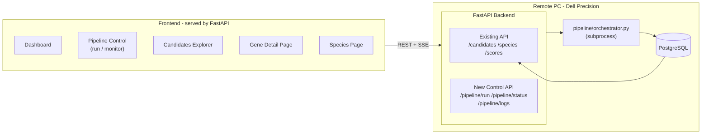

# BioResilient AI — Frontend Build Plan

## Architecture

The frontend is a **React + Vite SPA** built to `api/static/` and served by FastAPI at `/`. No separate hosting needed — users access it from the same URL as the API.

---

## Pages and Features

### 1. Dashboard

- Total candidates by tier (Tier 1 / 2 / 3) — three big number cards.
- Last pipeline run status and timestamp.
- Top 10 candidates bar chart (composite score).
- Quick links to Pipeline and Candidates pages.

### 2. Pipeline Control Panel

- Step-by-step progress tracker (18 steps shown as a visual timeline).
- "Run Full Pipeline" and "Resume From Step" buttons.
- Live log streaming via **Server-Sent Events (SSE)** — user sees what the pipeline is doing in real time without polling.
- Step status: pending / running / complete / failed with elapsed time per step.
- No deep technical knowledge needed — step labels use plain language ("Download proteomes", "Find orthologs", "Align sequences", etc.).

### 3. Candidates Explorer

- Sortable, filterable table of all scored genes.
- Filters: Tier (1/2/3), minimum composite score slider, gene name search.
- Each row shows: rank, gene symbol, composite score, tier badge, dN/dS ratio, convergence count, selection p-value.
- Click any row → Gene Detail page.

### 4. Gene Detail Page

- Score breakdown radar/bar chart (convergence, selection, expression, disease, druggability, safety, regulatory).
- Orthologs table: which resilient species have this gene, % sequence identity.
- Divergent motifs list: protein sequence windows that differ between human and resilient species.
- Phase 2 data (disease associations, druggability tier, AAV compatibility, safety flags) shown if populated.

### 5. Species Page

- Cards for each of the 12 species with photo placeholder, scientific name, key phenotypes (cancer resistance, longevity, etc.).
- Click species → see which candidate genes have orthologs in that species.

---

## Design System

**Aesthetic:** Dark scientific instrument — deep navy/slate backgrounds, sharp white typography, electric teal/cyan accents. Feels like a high-end research dashboard (think Bloomberg Terminal meets Vercel). Clean, data-forward, no clutter.

**Palette (CSS variables):**

- `--bg-base: #0a0f1e` — near-black navy, main background
- `--bg-surface: #111827` — card surfaces
- `--bg-elevated: #1a2235` — hover/selected states
- `--accent: #00d4ff` — electric cyan, primary accent
- `--accent-warm: #7c3aed` — violet, secondary accent (Tier 1 badges)
- `--success: #10b981` — emerald green (complete steps, Tier 1)
- `--warning: #f59e0b` — amber (Tier 2, running)
- `--danger: #ef4444` — red (failed, Tier 3)
- `--text-primary: #f1f5f9` — crisp white-slate text
- `--text-muted: #64748b` — secondary labels

**Typography:** `Inter` (body) + `JetBrains Mono` (gene symbols, sequences, scores, log output). Import from Google Fonts.

**Component style rules:**

- Cards: `rounded-xl`, subtle `border border-white/5`, `backdrop-blur` glass effect on surfaces.
- Tier badges: pill shape, color-coded — Tier 1 violet glow, Tier 2 amber, Tier 3 slate.
- Score bars: animated fill on load, teal gradient.
- Tables: zebra rows with `bg-white/[0.02]`, sticky header, smooth hover highlight.
- Buttons: primary = solid teal with subtle inner glow; secondary = ghost with teal border.
- Animations: `framer-motion` for page transitions and card entrance (staggered fade-up). Step timeline pulses while running.
- Charts: dark-themed Recharts with cyan/violet series colors, no chart borders, subtle grid lines.

**Layman-friendly language throughout:** No jargon visible to end users. "Convergence score" shown as "Resilience signal across species". dN/dS shown as "Evolutionary pressure". Technical values shown as tooltips on hover for advanced users, not as primary labels.

---

## Tech Stack

- **Frontend:** React 18, Vite, TailwindCSS v3, Framer Motion, Recharts, TanStack Table v8.
- **Fonts:** Inter + JetBrains Mono via Google Fonts.
- **API additions:** 3 new endpoints in `[api/routes/pipeline.py](api/routes/pipeline.py)` (new file) — `/pipeline/run`, `/pipeline/status`, `/pipeline/logs` (SSE stream).
- **Static serving:** FastAPI `StaticFiles` mount + fallback route for SPA routing. Vite build output goes to `api/static/dist/`.
- **Frontend location:** New `frontend/` directory at repo root.

---

## New Backend Endpoints

New file `[api/routes/pipeline.py](api/routes/pipeline.py)`:

- `POST /pipeline/run` — body: `{resume_from: str, dry_run: bool}` — starts orchestrator as a subprocess, returns `{run_id, started_at}`.
- `GET /pipeline/status` — returns current step, overall status (idle/running/failed/complete), last run timestamp, step-level durations.
- `GET /pipeline/logs` — SSE stream that tails the pipeline log file in real time.

Pipeline state is stored in a small `pipeline_state.json` file written by the orchestrator and read by the API — no new DB table needed.

---

## File Changes

**New files:**

- `frontend/` — entire React app (Vite project)
- `api/routes/pipeline.py` — 3 new control endpoints
- `api/static/` — Vite build output (git-ignored)

**Modified files:**

- `[api/main.py](api/main.py)` — mount `StaticFiles`, include pipeline router, add SPA fallback route
- `[pipeline/orchestrator.py](pipeline/orchestrator.py)` — write step progress to `pipeline_state.json` on each step start/complete

---

## Build Order

1. Add pipeline state writing to orchestrator
2. Build `api/routes/pipeline.py` (run, status, logs endpoints)
3. Wire pipeline router into `api/main.py` + add static file serving
4. Scaffold React app (`frontend/`) with Vite + Tailwind + Recharts
5. Build Dashboard page
6. Build Pipeline Control page (SSE log stream)
7. Build Candidates Explorer page
8. Build Gene Detail page
9. Build Species page
10. `npm run build` → output to `api/static/dist/`

