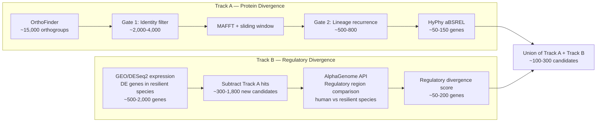
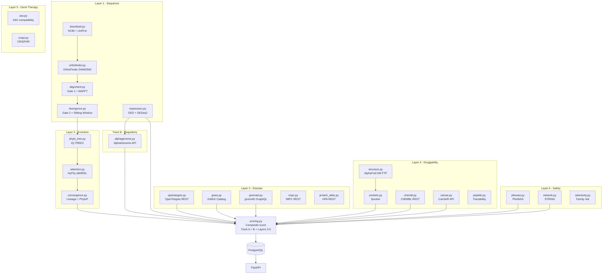
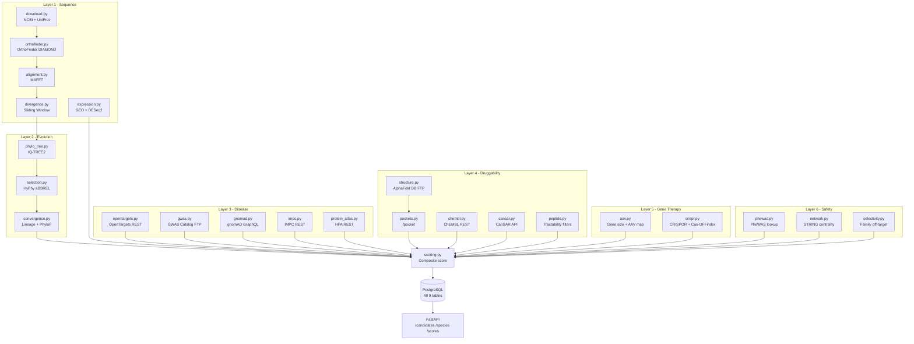

# BioResilient AI — Full Pipeline Build Plan

## Hardware Decision

Your Dell Precision 7820 outperforms the cloud option:


| Spec         | Local Machine         | c5.4xlarge + g4dn.xlarge |
| ------------ | --------------------- | ------------------------ |
| CPU cores    | 20                    | 16 + 4                   |
| RAM          | 32GB                  | 32GB + 16GB              |
| GPU VRAM     | 16GB (RTX 5000)       | 16GB (T4)                |
| Storage      | 3.1TB local NVMe      | EBS + S3                 |
| Cost per run | $0                    | ~$3–8                    |
| OS           | Ubuntu 22.04 (native) | Ubuntu 22.04 AMI         |


**All computation runs locally. No AWS spend required.**

---

## What Is Already Built (Phase 1)

The following modules have real implementations:

- `[pipeline/layer1_sequence/download.py](pipeline/layer1_sequence/download.py)` — NCBI Datasets v2 + Entrez fallback + UniProt
- `[pipeline/layer1_sequence/orthofinder.py](pipeline/layer1_sequence/orthofinder.py)` — OrthoFinder subprocess wrapper + TSV parsing + DB load
- `[pipeline/layer1_sequence/alignment.py](pipeline/layer1_sequence/alignment.py)` — MAFFT wrapper + identity calculation
- `[pipeline/layer1_sequence/divergence.py](pipeline/layer1_sequence/divergence.py)` — sliding window + ESM-2 distance (optional)
- `[pipeline/layer1_sequence/expression.py](pipeline/layer1_sequence/expression.py)` — GEO search + GEOparse + DESeq2 via rpy2
- `[pipeline/layer2_evolution/phylo_tree.py](pipeline/layer2_evolution/phylo_tree.py)` — IQ-TREE2 wrapper + concatenated alignment
- `[pipeline/layer2_evolution/selection.py](pipeline/layer2_evolution/selection.py)` — HyPhy aBSREL wrapper + JSON parsing
- `[pipeline/layer2_evolution/convergence.py](pipeline/layer2_evolution/convergence.py)` — lineage counting + UCSC PhyloP API
- `[pipeline/scoring.py](pipeline/scoring.py)` — composite scoring + tier assignment
- `[api/](api/)` — FastAPI with 3 endpoints

---

## Part 1 — Bug Fixes (4 bugs, existing files)

### Bug 1 — `get_ncbi_api_key()` NameError

`[pipeline/config.py](pipeline/config.py)` — `cfg_get(...)` references bare `cfg` variable that doesn't exist. Raises `NameError` at runtime.

### Bug 2 — Wrong import of `build_gene_og_map`

`[pipeline/orchestrator.py](pipeline/orchestrator.py)` step3b imports `build_gene_og_map` from `orthofinder.py` but it lives in `selection.py`. Raises `ImportError`.

### Bug 3 — HyPhy strips PATH

`[pipeline/layer2_evolution/selection.py](pipeline/layer2_evolution/selection.py)` — `run_absrel()` passes `env={"OMP_NUM_THREADS": ...}` which replaces the full OS environment. HyPhy binary not found.
Fix: `env={**os.environ, "OMP_NUM_THREADS": str(threads)}`

### Bug 4 — DB validation no-op

`[pipeline/orchestrator.py](pipeline/orchestrator.py)` step1 — `conn.execute_text = None` does nothing. Replace with `conn.execute(text("SELECT 1"))`.

---

## Part 2 — Two-Gate Funnel Architecture

The current code runs MAFFT and HyPhy on all orthogroups. This needs two explicit hard gates added to the orchestrator and alignment module.

### Gate 1 — Global Identity Pre-filter (before MAFFT)

Location: new function `filter_orthogroups_by_global_identity()` in `[pipeline/layer1_sequence/alignment.py](pipeline/layer1_sequence/alignment.py)`, called from orchestrator between step3b and step4.

Logic:

- For each orthogroup, compute a quick approximate identity using BLAST scores already in the OrthoFinder output (no re-alignment needed)
- Keep only orthogroups where at least 2 resilient species (non-human) show estimated divergence > 15% from human
- Expected reduction: 15,000 → 2,000–4,000 orthogroups passed to MAFFT

### Gate 2 — Motif Recurrence Filter (before HyPhy)

Location: new function `filter_by_independent_lineages()` in `[pipeline/layer1_sequence/divergence.py](pipeline/layer1_sequence/divergence.py)`, called from orchestrator between step4 and step6.

Logic:

- From the sliding window output, count how many **independent lineage groups** (Rodents, Cetaceans, Bats, Sharks, Primates, Salamanders) show a divergent motif at the same position
- Keep only orthogroups with divergent motifs in ≥2 independent lineages
- Expected reduction: 2,000–4,000 → 500–800 orthogroups passed to HyPhy

These two gates together mean HyPhy only ever sees ~500–800 genes instead of 15,000. Parallelised across 20 CPU cores on the local machine, the HyPhy step completes in 4–8 hours.

---

## Part 3 — Wire PhyloP Scores

`[pipeline/layer2_evolution/convergence.py](pipeline/layer2_evolution/convergence.py)` has `enrich_phylop_scores()` fully implemented (calls UCSC REST API) but it is never called from the orchestrator. A `chrom_map` builder using NCBI Gene API also needs to be added, and the orchestrator step7 needs to call `enrich_phylop_scores()` with the result.

---

## Part 4 — AlphaGenome: Track B (Regulatory Divergence)

### Why Track B Exists

The protein-coding funnel (Track A) discards genes where the protein sequence is conserved but the resilient animal expresses that gene differently — via regulatory region changes. These are valid drug targets. AlphaGenome, released by DeepMind (June 2025, API available for non-commercial research), predicts the regulatory effect of non-coding DNA variants.

### Architecture




Track B's pre-filter is the GEO/DESeq2 expression output already built in `[pipeline/layer1_sequence/expression.py](pipeline/layer1_sequence/expression.py)`. Only genes showing differential expression in resilient species are passed to AlphaGenome — not all 20,000. This keeps API call volume tractable (~300–1,800 genes at most).

### New files to build

`**pipeline/layer_regulatory/alphagenome.py**` (new directory)

- API: DeepMind AlphaGenome REST (`https://alphagenome.research.google.com/api/v1/`)
- API key: register at [deepmind.com/blog/alphagenome](https://deepmind.com/blog/alphagenome)
- Input: NCBI gene ID → fetch flanking genomic sequence (promoter ± 2kb) for human and resilient species
- Call: AlphaGenome variant scoring endpoint — diff between species regulatory sequence and human
- Output: regulatory divergence score per gene per species
- Aggregation: count independent lineages with significant regulatory divergence
- Populates new `RegulatoryDivergence` ORM table (to be added to `[db/models.py](db/models.py)`)

**New ORM table `RegulatoryDivergence`** in `[db/models.py](db/models.py)`:

```
gene_id             UUID FK(Gene)   PK
species_id          str  FK(Species)
promoter_divergence float    # AlphaGenome predicted effect
expression_log2fc   float    # from DESeq2
lineage_count       int      # independent lineages with signal
regulatory_score    float    # combined
```

---

## Part 5 — Phase 2 Pipeline Layers

All four layer directories exist with empty `__init__.py` files. The ORM models are already schema-defined in `[db/models.py](db/models.py)`. The work is building the pipeline logic files.

### Full pipeline architecture after complete build




---

### Layer 3 — Disease Annotation (5 files)

All free APIs, no keys required.

`**pipeline/layer3_disease/opentargets.py**`

- REST API: `https://api.platform.opentargets.org/api/v4/graphql`
- Input: gene symbol or Ensembl ID
- Output: disease associations with scores, populates `DiseaseAnnotation.opentargets_score`

`**pipeline/layer3_disease/gwas.py**`

- Source: GWAS Catalog REST API `https://www.ebi.ac.uk/gwas/rest/api`
- Input: gene symbol
- Output: strongest association p-value, populates `DiseaseAnnotation.gwas_pvalue`

`**pipeline/layer3_disease/gnomad.py**`

- GraphQL API: `https://gnomad.broadinstitute.org/api`
- Input: Ensembl gene ID
- Output: pLI constraint score, populates `DiseaseAnnotation.gnomad_pli`

`**pipeline/layer3_disease/impc.py**`

- REST API: `https://www.ebi.ac.uk/mi/impc/solr/genotype-phenotype/select`
- Input: gene symbol
- Output: mouse KO phenotype string, populates `DiseaseAnnotation.mouse_ko_phenotype`

`**pipeline/layer3_disease/protein_atlas.py**`

- REST API: `https://www.proteinatlas.org/api/search_download.php`
- Input: gene symbol
- Output: tissue TPM expression map, populates `DiseaseAnnotation.tissue_expression`

---

### Layer 4 — Druggability (5 files)

`**pipeline/layer4_druggability/structure.py**`

- Source: AlphaFold DB FTP `https://ftp.ebi.ac.uk/pub/databases/alphafold/`
- Downloads pre-computed PDB files for human proteins — no local inference needed
- Caches to `./data/structures/{uniprot_id}.pdb`

`**pipeline/layer4_druggability/pockets.py**`

- Tool: fpocket (already in `environment.yml`)
- Runs `fpocket -f {pdb_file} -m 3.0` on each downloaded structure
- Parses pocket count and top pocket score
- Populates `DrugTarget.pocket_count`, `DrugTarget.top_pocket_score`

`**pipeline/layer4_druggability/chembl.py**`

- REST API: `https://www.ebi.ac.uk/chembl/api/data/target`
- Input: UniProt accession
- Output: ChEMBL target ID, list of approved drugs
- Populates `DrugTarget.chembl_target_id`, `DrugTarget.existing_drugs`

`**pipeline/layer4_druggability/cansar.py**`

- REST API: `https://cansar.ai/api/` (free registration required)
- Input: UniProt accession
- Output: CanSAR druggability score
- Populates `DrugTarget.cansar_score`, `DrugTarget.druggability_tier`

`**pipeline/layer4_druggability/peptide.py**`

- No external API — applies local rules to `DivergentMotif` records
- Rules: length 10–20 aa, no transmembrane region (from Atlas data), half-life estimate via Boman index
- Populates `DivergentMotif.half_life_min`, `DivergentMotif.synthesisable`

---

### Layer 5 — Gene Therapy (2 files)

`**pipeline/layer5_gene_therapy/aav.py**`

- Reads gene size from NCBI Gene API
- Applies AAV packaging limit rule (< 4.7kb = compatible)
- Hardcoded tissue tropism map for AAV serotypes (AAV9 = CNS, AAV8 = liver, etc.)
- Populates `GeneTherapyScore.gene_size_bp`, `GeneTherapyScore.aav_compatible`, `GeneTherapyScore.tissue_tropism`

`**pipeline/layer5_gene_therapy/crispr.py**`

- Tool: CRISPOR (local install) or Cas-OFFinder
- Input: gene sequence window around divergent motif
- Output: number of valid guide RNA sites, off-target risk score
- Populates `GeneTherapyScore.crispr_sites`, `GeneTherapyScore.offtarget_risk`

---

### Layer 6 — Safety (3 files)

`**pipeline/layer6_safety/phewas.py**`

- Source: GWAS Catalog phenome-wide associations
- Input: gene symbol
- Output: all phenotypic associations as JSON
- Populates `SafetyFlag.phewas_hits`

`**pipeline/layer6_safety/network.py**`

- REST API: `https://string-db.org/api` (free, no key)
- Input: gene symbol + species taxid 9606
- Output: interaction count (network degree), hub flag (degree > 50)
- Populates `SafetyFlag.network_degree`, `SafetyFlag.hub_risk`

`**pipeline/layer6_safety/selectivity.py**`

- Source: UniProt family classification API
- Input: UniProt accession
- Output: protein family size
- Populates `SafetyFlag.family_size`
- Also reads `DiseaseAnnotation.gnomad_pli > 0.9` → sets `SafetyFlag.is_essential`

---

## Part 6 — Orchestrator Updates

`[pipeline/orchestrator.py](pipeline/orchestrator.py)` receives new steps, with funnel gates made explicit:

- `step3c_gate1_identity_filter()` — Gate 1: global identity pre-filter before MAFFT
- `step4b_gate2_lineage_filter()` — Gate 2: motif recurrence filter before HyPhy
- `step10b_alphagenome()` — Track B: AlphaGenome on expression-positive genes not in Track A
- `step11_disease_annotation()` — Layer 3: runs on Track A + Track B union (post-funnel)
- `step12_druggability()` — Layer 4: AlphaFold structures + fpocket + ChEMBL/CanSAR
- `step13_gene_therapy()` — Layer 5: AAV + CRISPR for Tier1 candidates
- `step14_safety()` — Layer 6: PheWAS, STRING, selectivity
- `step15_rescore()` — full rescore with phase2 weights
- `step16_start_api()` — renamed from step10

---

## Part 7 — Scoring Update

`[pipeline/scoring.py](pipeline/scoring.py)` needs:

- `regulatory_score()` — from `RegulatoryDivergence.regulatory_score` (Track B signal)
- `disease_score()` — from `opentargets_score`, `gwas_pvalue`, `gnomad_pli`
- `druggability_score()` — from `pocket_count`, `top_pocket_score`, `druggability_tier`
- `safety_score()` — inverted: high `hub_risk`, high `family_size`, `is_essential` all reduce score

The `CandidateScore` table already has columns for all these. The `regulatory_score` column needs to be added to the model and the migration.

---

## Part 8 — Local Machine Setup

`[scripts/setup_local.sh](scripts/setup_local.sh)` already exists. Two updates:

- Enable ESM-2 3B model in `[config/environment.example.yml](config/environment.example.yml)` (RTX 5000 has 16GB VRAM, 3B fits)
- Add `ALPHAGENOME_API_KEY` to the config template

---

## API Keys Needed


| API                 | Key Required            | How to Get                                            | Cost |
| ------------------- | ----------------------- | ----------------------------------------------------- | ---- |
| NCBI Entrez         | Yes (already in config) | ncbi.nlm.nih.gov/account                              | Free |
| AlphaGenome         | Yes — new               | deepmind.com/blog/alphagenome (non-commercial access) | Free |
| OpenTargets         | No                      | —                                                     | Free |
| GWAS Catalog        | No                      | —                                                     | Free |
| gnomAD GraphQL      | No                      | —                                                     | Free |
| IMPC                | No                      | —                                                     | Free |
| Human Protein Atlas | No                      | —                                                     | Free |
| AlphaFold DB FTP    | No                      | —                                                     | Free |
| ChEMBL REST         | No                      | —                                                     | Free |
| STRING REST         | No                      | —                                                     | Free |
| CanSAR              | Registration only       | cansar.ai/user/register                               | Free |
| UCSC REST (PhyloP)  | No                      | —                                                     | Free |


**Two APIs require registration: AlphaGenome (DeepMind) and CanSAR. Both are free.**

---

## Build Order

1. Fix 4 bugs
2. Implement two funnel gates in orchestrator + alignment + divergence modules
3. Wire PhyloP chrom_map lookup
4. New `RegulatoryDivergence` ORM table + migration + `regulatory_score` column on `CandidateScore`
5. `pipeline/layer_regulatory/alphagenome.py` (Track B)
6. Layer 3 disease files (5 files)
7. Layer 4 druggability files (5 files)
8. Layer 5 gene therapy files (2 files)
9. Layer 6 safety files (3 files)
10. Orchestrator steps 3c, 4b, 10b, 11–16
11. Scoring Phase 2 sub-score functions including `regulatory_score()`
12. Config update for RTX 5000 + AlphaGenome key field
13. Tests for funnel gates, AlphaGenome track, layers 3–6

## Hardware Decision

Your Dell Precision 7820 outperforms the cloud option:


| Spec         | Local Machine         | c5.4xlarge + g4dn.xlarge |
| ------------ | --------------------- | ------------------------ |
| CPU cores    | 20                    | 16 + 4                   |
| RAM          | 32GB                  | 32GB + 16GB              |
| GPU VRAM     | 16GB (RTX 5000)       | 16GB (T4)                |
| Storage      | 3.1TB local NVMe      | EBS + S3                 |
| Cost per run | $0                    | ~$3–8                    |
| OS           | Ubuntu 22.04 (native) | Ubuntu 22.04 AMI         |


**All computation runs locally. No AWS spend required.**

---

## What Is Already Built (Phase 1)

The following modules have real implementations:

- `[pipeline/layer1_sequence/download.py](pipeline/layer1_sequence/download.py)` — NCBI Datasets v2 + Entrez fallback + UniProt
- `[pipeline/layer1_sequence/orthofinder.py](pipeline/layer1_sequence/orthofinder.py)` — OrthoFinder subprocess wrapper + TSV parsing + DB load
- `[pipeline/layer1_sequence/alignment.py](pipeline/layer1_sequence/alignment.py)` — MAFFT wrapper + identity calculation
- `[pipeline/layer1_sequence/divergence.py](pipeline/layer1_sequence/divergence.py)` — sliding window + ESM-2 distance (optional)
- `[pipeline/layer1_sequence/expression.py](pipeline/layer1_sequence/expression.py)` — GEO search + GEOparse + DESeq2 via rpy2
- `[pipeline/layer2_evolution/phylo_tree.py](pipeline/layer2_evolution/phylo_tree.py)` — IQ-TREE2 wrapper + concatenated alignment
- `[pipeline/layer2_evolution/selection.py](pipeline/layer2_evolution/selection.py)` — HyPhy aBSREL wrapper + JSON parsing
- `[pipeline/layer2_evolution/convergence.py](pipeline/layer2_evolution/convergence.py)` — lineage counting + UCSC PhyloP API
- `[pipeline/scoring.py](pipeline/scoring.py)` — composite scoring + tier assignment
- `[api/](api/)` — FastAPI with 3 endpoints

---

## Part 1 — Bug Fixes (4 bugs, existing files)

### Bug 1 — `get_ncbi_api_key()` NameError

`[pipeline/config.py](pipeline/config.py)` — `cfg_get(...)` references bare `cfg` variable that doesn't exist. Raises `NameError` at runtime.

### Bug 2 — Wrong import of `build_gene_og_map`

`[pipeline/orchestrator.py](pipeline/orchestrator.py)` step3b imports `build_gene_og_map` from `orthofinder.py` but it lives in `selection.py`. Raises `ImportError`.

### Bug 3 — HyPhy strips PATH

`[pipeline/layer2_evolution/selection.py](pipeline/layer2_evolution/selection.py)` — `run_absrel()` passes `env={"OMP_NUM_THREADS": ...}` which replaces the full OS environment. HyPhy binary not found.
Fix: `env={**os.environ, "OMP_NUM_THREADS": str(threads)}`

### Bug 4 — DB validation no-op

`[pipeline/orchestrator.py](pipeline/orchestrator.py)` step1 — `conn.execute_text = None` does nothing. Replace with `conn.execute(text("SELECT 1"))`.

---

## Part 2 — Wire PhyloP Scores

`[pipeline/layer2_evolution/convergence.py](pipeline/layer2_evolution/convergence.py)` has `enrich_phylop_scores()` fully implemented (calls UCSC REST API) but it is never called from the orchestrator. A `chrom_map` builder using NCBI Gene API also needs to be added, and the orchestrator step7 needs to call `enrich_phylop_scores()` with the result.

---

## Part 3 — Phase 2 Pipeline Layers

All four layer directories exist with empty `__init__.py` files. The ORM models are already schema-defined in `[db/models.py](db/models.py)`. The work is building the pipeline logic files.

### Pipeline architecture after full build




---

### Layer 3 — Disease Annotation (5 files)

All free APIs, no keys required.

`**pipeline/layer3_disease/opentargets.py**`

- REST API: `https://api.platform.opentargets.org/api/v4/graphql`
- Input: gene symbol or Ensembl ID
- Output: disease associations with scores, populates `DiseaseAnnotation.opentargets_score`

`**pipeline/layer3_disease/gwas.py**`

- Source: GWAS Catalog REST API `https://www.ebi.ac.uk/gwas/rest/api`
- Input: gene symbol
- Output: strongest association p-value, populates `DiseaseAnnotation.gwas_pvalue`

`**pipeline/layer3_disease/gnomad.py**`

- GraphQL API: `https://gnomad.broadinstitute.org/api`
- Input: Ensembl gene ID
- Output: pLI constraint score, populates `DiseaseAnnotation.gnomad_pli`

`**pipeline/layer3_disease/impc.py**`

- REST API: `https://www.ebi.ac.uk/mi/impc/solr/genotype-phenotype/select`
- Input: gene symbol
- Output: mouse KO phenotype string, populates `DiseaseAnnotation.mouse_ko_phenotype`

`**pipeline/layer3_disease/protein_atlas.py**`

- REST API: `https://www.proteinatlas.org/api/search_download.php`
- Input: gene symbol
- Output: tissue TPM expression map, populates `DiseaseAnnotation.tissue_expression`

---

### Layer 4 — Druggability (5 files)

`**pipeline/layer4_druggability/structure.py**`

- Source: AlphaFold DB FTP `https://ftp.ebi.ac.uk/pub/databases/alphafold/`
- Downloads pre-computed PDB files for human proteins — no local inference needed
- Caches to `./data/structures/{uniprot_id}.pdb`

`**pipeline/layer4_druggability/pockets.py**`

- Tool: fpocket (already in `environment.yml`)
- Runs `fpocket -f {pdb_file} -m 3.0` on each downloaded structure
- Parses pocket count and top pocket score
- Populates `DrugTarget.pocket_count`, `DrugTarget.top_pocket_score`

`**pipeline/layer4_druggability/chembl.py**`

- REST API: `https://www.ebi.ac.uk/chembl/api/data/target`
- Input: UniProt accession
- Output: ChEMBL target ID, list of approved drugs
- Populates `DrugTarget.chembl_target_id`, `DrugTarget.existing_drugs`

`**pipeline/layer4_druggability/cansar.py**`

- REST API: `https://cansar.ai/api/` (free registration required)
- Input: UniProt accession
- Output: CanSAR druggability score
- Populates `DrugTarget.cansar_score`, `DrugTarget.druggability_tier`

`**pipeline/layer4_druggability/peptide.py**`

- No external API — applies local rules to `DivergentMotif` records
- Rules: length 10–20 aa, no transmembrane region (from Atlas data), half-life estimate via Boman index
- Populates `DivergentMotif.half_life_min`, `DivergentMotif.synthesisable`

---

### Layer 5 — Gene Therapy (2 files)

`**pipeline/layer5_gene_therapy/aav.py**`

- No external API for Phase 1 of this layer
- Reads gene size from NCBI Gene API
- Applies AAV packaging limit rule (< 4.7kb = compatible)
- Hardcoded tissue tropism map for AAV serotypes (AAV9 = CNS, AAV8 = liver, etc.)
- Populates `GeneTherapyScore.gene_size_bp`, `GeneTherapyScore.aav_compatible`, `GeneTherapyScore.tissue_tropism`

`**pipeline/layer5_gene_therapy/crispr.py**`

- Tool: CRISPOR (local install) or Cas-OFFinder
- Input: gene sequence window around divergent motif
- Output: number of valid guide RNA sites, off-target risk score
- Populates `GeneTherapyScore.crispr_sites`, `GeneTherapyScore.offtarget_risk`

---

### Layer 6 — Safety (3 files)

`**pipeline/layer6_safety/phewas.py**`

- Source: PheWAS Catalog REST or GWAS Catalog (phenome-wide)
- Input: gene symbol
- Output: all phenotypic associations as JSON
- Populates `SafetyFlag.phewas_hits`

`**pipeline/layer6_safety/network.py**`

- REST API: `https://string-db.org/api` (free, no key)
- Input: gene symbol + species taxid 9606
- Output: interaction count (network degree), hub flag (degree > 50)
- Populates `SafetyFlag.network_degree`, `SafetyFlag.hub_risk`

`**pipeline/layer6_safety/selectivity.py**`

- Source: UniProt family classification API
- Input: UniProt accession
- Output: protein family size (how many closely related proteins exist)
- Populates `SafetyFlag.family_size`
- Also reads `DiseaseAnnotation.gnomad_pli > 0.9` → sets `SafetyFlag.is_essential`

---

## Part 4 — Orchestrator Updates

`[pipeline/orchestrator.py](pipeline/orchestrator.py)` needs new steps wired in after step9 (current last step):

- `step11_disease_annotation()` — runs all 5 layer3 modules for top candidates (Tier1 + Tier2)
- `step12_druggability()` — downloads AlphaFold structures, runs fpocket, queries ChEMBL/CanSAR for top candidates
- `step13_gene_therapy()` — runs AAV + CRISPR assessment for Tier1 candidates only
- `step14_safety()` — runs PheWAS, STRING, selectivity for Tier1 + Tier2
- `step15_rescore()` — re-runs `scoring.py` with `phase2` weights after all layers populated
- `step16_start_api()` — renamed from step10

**Funnel gating:** Layers 3–6 run only on genes that passed the Phase 1 funnel (Tier1 + Tier2 from step9). This is the optimisation that keeps costs near zero — expensive API calls only on ~50–200 genes, not all 15,000.

---

## Part 5 — Scoring Update

`[pipeline/scoring.py](pipeline/scoring.py)` needs two new sub-score functions:

- `disease_score()` — from `opentargets_score`, `gwas_pvalue`, `gnomad_pli`
- `druggability_score()` — from `pocket_count`, `top_pocket_score`, `chembl_target_id`, `druggability_tier`
- `safety_score()` — inverted: high hub_risk, high family_size, is_essential all reduce score

Phase 2 weights (already in `[config/scoring_weights.json](config/scoring_weights.json)`) then apply automatically.

---

## Part 6 — Local Machine Setup

`[scripts/setup_local.sh](scripts/setup_local.sh)` already exists but needs one addition: the RTX 5000 has 16GB VRAM, so the ESM-2 3B model (`esm2_t36_3B_UR50D`) should be enabled in config instead of the default 650M model. Update `[config/environment.example.yml](config/environment.example.yml)` GPU section accordingly.

---

## API Keys Needed


| API                 | Key Required            | How to Get               | Cost |
| ------------------- | ----------------------- | ------------------------ | ---- |
| NCBI Entrez         | Yes (already in config) | ncbi.nlm.nih.gov/account | Free |
| OpenTargets         | No                      | —                        | Free |
| GWAS Catalog        | No                      | —                        | Free |
| gnomAD GraphQL      | No                      | —                        | Free |
| IMPC                | No                      | —                        | Free |
| Human Protein Atlas | No                      | —                        | Free |
| AlphaFold DB FTP    | No                      | —                        | Free |
| ChEMBL REST         | No                      | —                        | Free |
| STRING REST         | No                      | —                        | Free |
| CanSAR              | Registration only       | cansar.ai/user/register  | Free |
| UCSC REST (PhyloP)  | No                      | —                        | Free |


**Only CanSAR requires registration. All others are open.**

---

## Build Order

1. Fix 4 bugs (fast — 4 small edits)
2. Wire PhyloP in orchestrator + build chrom_map lookup
3. Layer 3 disease files (5 files)
4. Layer 4 druggability files (5 files)
5. Layer 5 gene therapy files (2 files)
6. Layer 6 safety files (3 files)
7. Orchestrator steps 11–16
8. Scoring Phase 2 sub-score functions
9. Config update for RTX 5000 (ESM-2 3B)
10. Tests for layers 3–6

